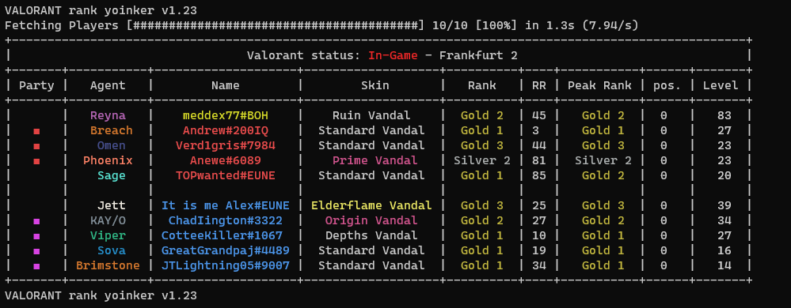
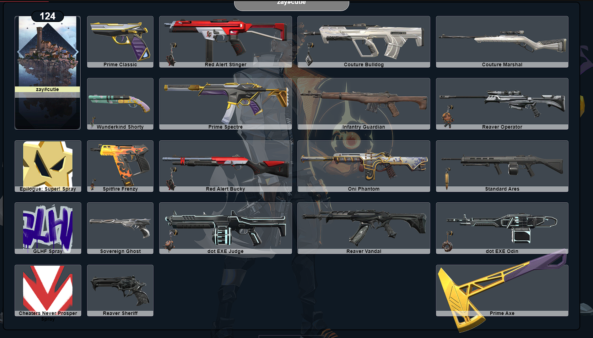
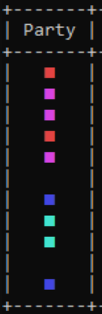
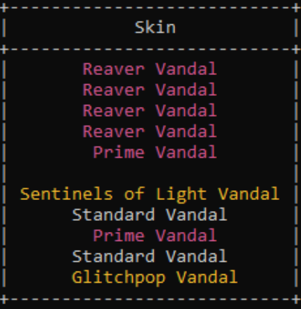
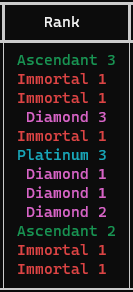
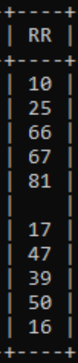
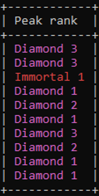
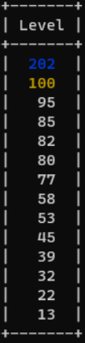

    
<h5 align="center"> VALORANT rank yoinker</h5>

[![Discord][discord-shield]][discord-url]
[![Downloads][downloads-shield]][downloads-url]
[![Language][language-shield]][language-url]
[![YouTube][youtube-shield]][youtube-url]
[![License][license-shield]][license-url]
     
 
  <ol>
    <li><a href="#about-the-project">About The Project</a></li>
    <li><a href="#usage">Usage</a></li>
    <li><a href="#contributing">Contributing</a></li>
    <li><a href="#contact">Contact</a></li>
    <li><a href="#acknowledgements">Acknowledgements</a></li>
    <li><a href="#disclaimer">Disclaimer</a></li>
  </ol>

    
## About The Project

 
 

|Their Queue|Current Skin|Current Rank|Rank Rating|Peak Rank|Account Level|
|:---:|:---:|:---:|:---:|:---:|:---:|
|||||||
    

## Usage
    
 VALORANT must be open for this to work.
 
**IMPORTANT: The .exe must be kept with its files, you can create a shortcut to it if you want to place it elsewhere.**

Download and run the [release](https://github.com/isaacKenyon/valorant-rank-yoinker/releases/latest).

To view a player's equipped inventory visit [this website](https://vry.netlify.app/matchLoadouts).

Tutorial:
  
  [![YouTube][youtube-shield]][youtube-url]

## Contributing

 Any contributions you make are **greatly appreciated**.

 1. Fork the Project `(gh repo fork https://github.com/isaacKenyon/VALORANT-rank-yoinker)`
 2. Commit your Changes `(git commit -am 'Add some feature')`
 3. [Open a Pull Request](https://docs.github.com/en/pull-requests/collaborating-with-pull-requests/proposing-changes-to-your-work-with-pull-requests/creating-a-pull-request-from-a-fork)

 
## Contact 

 Join the community discord:         
 
[![Discord Banner 2][discord-banner]][discord-url]

## Acknowledgements

 - [Valorant-API.com](https://valorant-api.com/)
 - [Hamper for all his amazing work](https://github.com/OwOHamper)

 
 
## Disclaimer

 THIS PROJECT IS NOT ASSOCIATED OR ENDORSED BY RIOT GAMES. Riot Games, and all associated properties are trademarks or registered trademarks of Riot Games, Inc.
    
 Also Rito, if you send a cease-and-desist, just know that I will frame it inside my bedroom
    

[discord-shield]: https://img.shields.io/discord/872101595037446144?color=7289da&label=Support&logo=discord&logoColor=7289da&style=for-the-badge
[discord-url]: https://discord.gg/HeTKed64Ka
[discord-banner]: https://discordapp.com/api/guilds/872101595037446144/widget.png?style=banner2

[downloads-shield]: https://img.shields.io/github/downloads/isaacKenyon/VALORANT-rank-yoinker/total?style=for-the-badge&logo=github
[downloads-url]: https://github.com/isaacKenyon/VALORANT-rank-yoinker/releases/latest

[language-shield]: https://img.shields.io/github/languages/top/isaacKenyon/Valorant-rank-yoinker?logo=python&logoColor=yellow&style=for-the-badge
[language-url]: https://www.python.org/

[youtube-shield]: https://img.shields.io/badge/YouTube-FF0000?style=for-the-badge&logo=youtube&logoColor=white
[youtube-url]: https://youtu.be/TSLRd8Y9PiE

[license-shield]: https://img.shields.io/github/license/isaacKenyon/valorant-rank-yoinker?style=for-the-badge
[license-url]: https://github.com/isaacKenyon/valorant-rank-yoinker/blob/main/LICENSE
